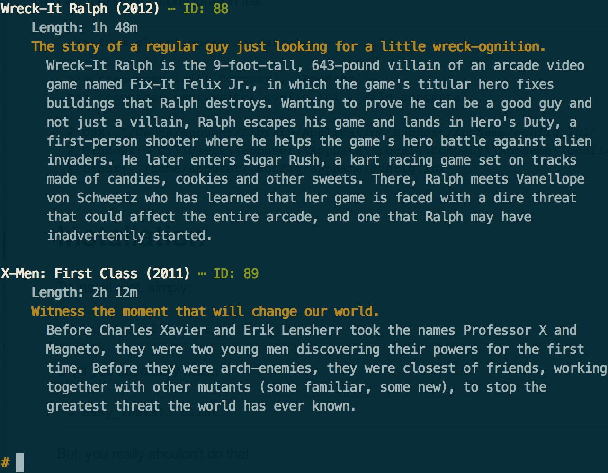

shucks
======

A command-line JSON-RPC client for XBMC.

Features
========

Nothing important at the moment. This doesn't do much yet.

Everything's in `shucks/__init__.py`, which is kind of messed up, but you're
just going to have to live with that for the moment. That's kind of a feature,
right?

Installation
============

Install the dependencies with pip:

    $ pip install -r requirements.txt

Install the `shucks` script:

    $ python setup.py install

Usage
=====

<pre>
    <code>
    $ shucks [--host=XBMC_SERVER_IP] [--port=WEB_SERVICES_PORT]
    <strong style="color: goldenrod">#</strong> ping
    &#10003; Ping successful.
    </code>
</pre>

Supported commands:

*   `ping`: Call "JSONRPC.Ping" to test connectivity.
*   `list movies`: Call "VideoLibrary.GetMovies" and format the output nicely.
    
*   `movies`: Alias of `list movies`
*   `info movie <id>`: Print out information about the movie whose ID is
    `<id>`. (Output is the same as for an individual movie in `list movies`)
*   `players`: Lists the currently active players.
*   `exit`/`quit`: What you would expect.

Note that very few of the commands have cleanly formatted output at this point.

Q&A
===

## Why is it called 'shucks'?

As I was driving home and thinking about creating this script, I also was
dreaming up a name for it. `xsh`/`xbmcsh` (XBMC shell) came to mind, as did
`shx`/`shxbmc`. I liked `shx`, but thought `shucks` is a more comedic name.

## Why does this exist?

Because I don't particularly like XBMC's web-interface controls, or the Android
remote, or any other command-line clients I've come across. At least, not
enough to want to continue using them.

## Where will it run?

Tested on OS X 10.9.2. Should run on most sane Linux distros.

License
=======

MIT
